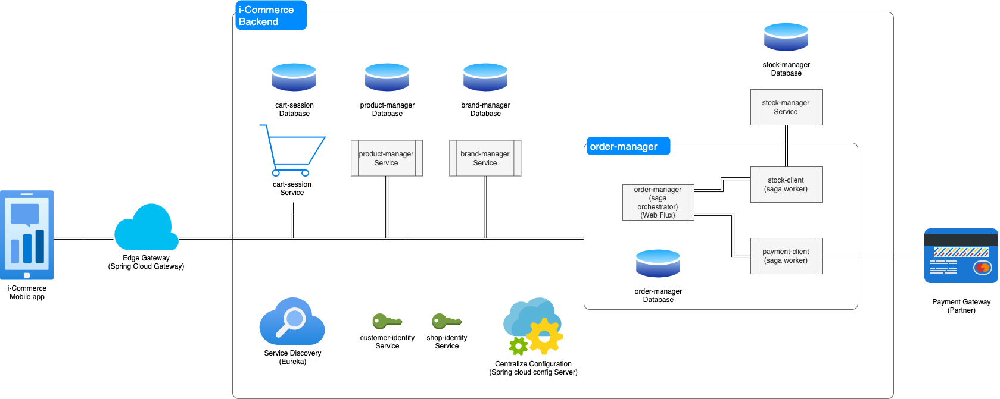

# I-Commerce system documentation

## 0/ Introduce
We planned to build an e-commerce system that play as a market role, 
where Customer and Shop meet each others, and shopping experience happen

Shop Administrator can log-in, manage their product, brand, category, price

Customer can search for needed product, add to cart, and place an order

We build this system using Micro-Service Architecture approach.

In order to easily scale our system, we use Saga Orchestration pattern, 
with Spring Web Flux to provide a Reactive-Base Order Management Service,
which optimize computing resource, and easily scale when more and more customer come day by day.

## 1/ Overview

In this system, whole back-end is a large heart where the business happen.

Back-end system provide the world capability to interact with it, by expose Open API Restful specification.

Also, we integrated with 3rd party to use the online payment capability in the future.

## 2/ Technology stack
### 2.1/ Spring boot, JPA, Hibernate
We use spring boot, which have large community, robust framework

It provides Dependency-Injection, Aspect Oriented Programming capability.

JPA provides good abstraction layer to play with database, 
and Hibernate do the difficult work, mapping Entity Relationship to Object-Oriented and vice versa.

### 2.2/ Spring WebFlux
We use Spring WebFlux to archive Reactive Programming Model, easy scale, 
and minimize the computing resources that needed

### 2.3/ Saga Orchestration
Saga Orchestration is a very good pattern to deal with multi-service transactional task

With Saga Orchestration, we can easily control our workflow, 
and reduce the concern for each worker service.

## 3/ Back-end components
### 3.1/ Edge gateway
We don't want the world mind how many service that we have, 
and how many end-point that they need to interact with.

With Edge service, just only one they need to touch

We use Spring API Gateway for this

### Service discovery
In the world of microservice, when ton of services is added, 
the fact that each team should remember each other service IP & Port will soon become nightmare.

Service discovery help us on this, they just need to tell the name of service they want to call,
Service discovery do the rest

We use Spring Eureka for this.

Of course, when we bring this to the Cloud, with Kubernetes, we can use Kubernetes Discovery to replace this